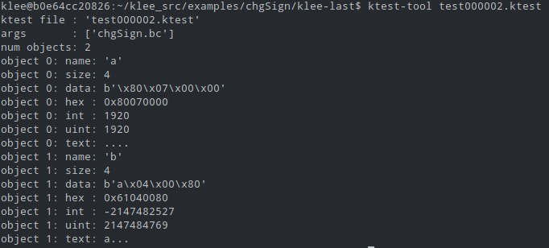
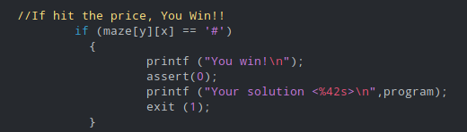
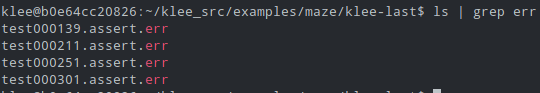

## SLO: Labo 3b

**Auteurs:** Barros Henriques Chris, Blanc Jean-Lux, Daubresse Gaëtan

### 4 Analyser une Fonction Simple

**Question 4.1**

> Que fait l’option –only-output-states-covering-new ? Pourquoi l’activer ?

Il permet de limiter le nombre de fichiers de test générés. En effet, celui-ci normalement crée un fichier de test pour chaque cas qu’il a traité. Ici, au lieu de ça, il n’en crée que lorsque le cas traité amène à un tout nouveau chemin dans le programme. On peut trouver cete information à la [page du tutoriel](https://klee.github.io/tutorials/testing-regex/) sur les regex.

**Question 4.2**

> Que contiennent les fichiers en .ptr.err. Comment les ouvrez-vous ?
> Que contiennent les fichiers en .ktest. Comment les lisez-vous ?

Pour les fichiers .ptr.err, o peut utiliser la commande `cat`. Ces derniers contiennent les erreurs rencontrées lors de l’exécution du programme.

Pour les fichiers .ktest, selon la [documentation](https://klee.github.io/docs/files/) de Klee, on utilise la commande:

`ktest-tool ktest-last/test000003.ktest` pour lire ce fichier par exemple. On trouve à l’intérieur le nom du fichier, la valeur du test (sous différents formats) et d’autres informations à propos du programme.

**Question 4.3** 

> Que fait la fonction fournie ?

On voit que l’on test si x est plus grand que y, les calculs qui suivent impliquent simplement que la valeur de x est stockée dans y et celle de y dans x. Et on renvoie la différence de ceux-ci.

Si le test échoue et que x est plus petit que y, on renvoie alors tout de suite leur différence. 

La fonction calcule donc: $ x - y$ $ | $ $ \forall x < y$

On voit qu’il y a un assert qui est effectué si jamais après l’échange, leur différence venait à être plus grande que 0.

**Question 4.4** 

> Quel bug est trouvé par KLEE ? Donnez un input permettant d’obtenir ce
> bug et expliquez ce qui ne va pas dans la fonction.

On voit que qu’il y a un test qui amène à une erreur. Le problème ici est que la valeur de y amène à un integer overflow et est interpretée comme la valeur -2147482527 en int. 

### 5 Labyrinthe

**Question 5.1**

> Listez tous les chemins gagnants trouvés par KLEE. Expliquez pourquoi
> chacun de ces chemins est gagnant en vous référant au code.

Comme on l’a vu précédemment, les fichiers .err répertorient les erreurs qui ont eu lieu lors de l’exécution du programme. Pour détecter les input de Klee qui font gagner, on va s’arranger pour faire produire une erreur à ce moment-là. On modifie donc le programme de cette manière en insérant un assert:

De cette manière, on peut ensuite liste les différents cas où il y a eu des erreurs:

Il suffit ensuite d’addicher le contenu des fichiers .ktest avec ktest-tool avec le numéro de cas correspondant pour obtenir les solutions qui sont:

- ssssddddwwaawwddddssssddwwww
- ssssddddwwaawwddddsddw
- sddwddddssssddwwww
- sddwddddsddw

### 6 Keygen avec KLEE

**Question 6.1**

> À quoi servent les différentes options passées à KLEE ?

**Question 6.2**

> Quel est le mot de passe permettant de lancer le programme ?

### 7 Algorithmes de Tri

**Question 7.1**

> Que fait la fonction test() du fichier sort.c ?

**Question 7.2**

> Quel problème rencontrez-vous ?

**Question 7.3**

> Quel est le bug dans le code ? Donnez un patch le corrigeant

### 8 Comparaison avec le Fuzzer

**Question 8.1**

> Que pouvez-vous dire sur les performances de KLEE sur cet exemple par
> rapport à afl? Pourquoi avons-nous de telles différences ? Justifiez votre
> réponse.